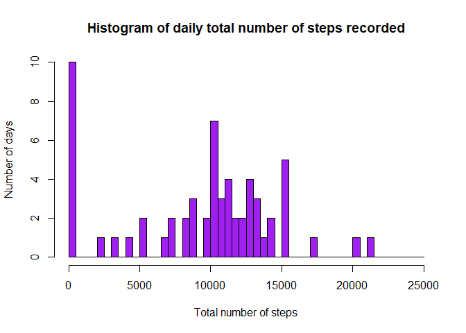
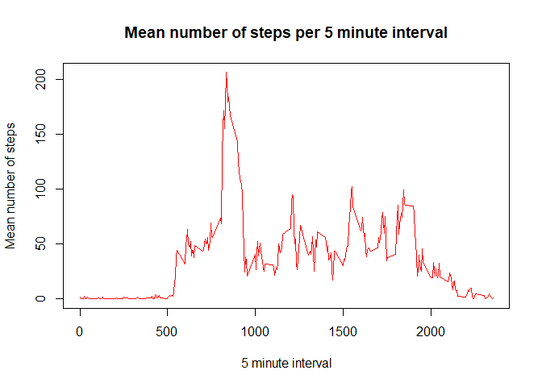
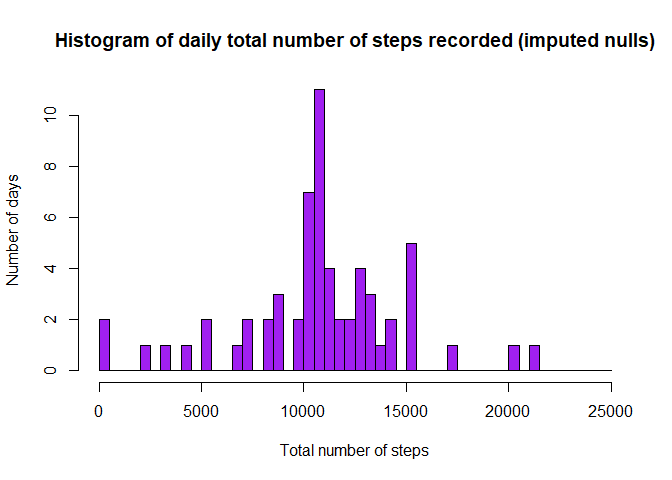
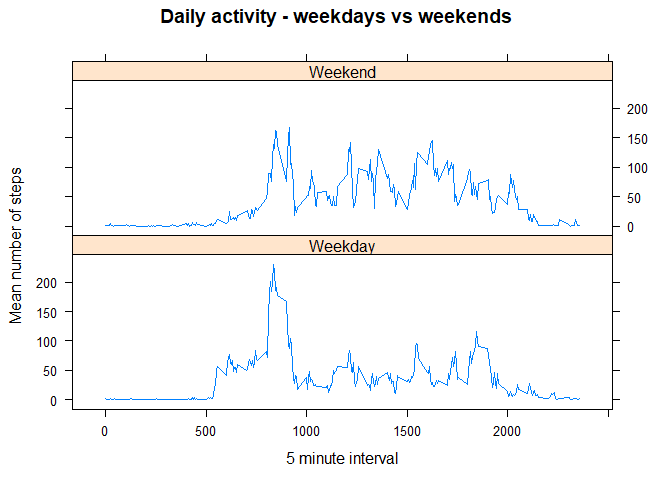

**Loading and preprocessing the data**


```r
data <- read.csv(unz("activity.zip",
                       "activity.csv"),header=TRUE)
data$date = as.Date(data$date, "%Y-%m-%d")
summary(data)
```

```
##      steps             date               interval     
##  Min.   :  0.00   Min.   :2012-10-01   Min.   :   0.0  
##  1st Qu.:  0.00   1st Qu.:2012-10-16   1st Qu.: 588.8  
##  Median :  0.00   Median :2012-10-31   Median :1177.5  
##  Mean   : 37.38   Mean   :2012-10-31   Mean   :1177.5  
##  3rd Qu.: 12.00   3rd Qu.:2012-11-15   3rd Qu.:1766.2  
##  Max.   :806.00   Max.   :2012-11-30   Max.   :2355.0  
##  NA's   :2304
```

**What is mean total number of steps taken per day?**

For this part of the assignment, will will ignore the missing values in the dataset.

1. Calculate the total number of steps taken per day


```r
dailySteps = aggregate(data$steps, by = list(data$date), FUN=sum, na.rm=TRUE)
names(dailySteps) <- c("date", "totalSteps")
str(dailySteps)
```

```
## 'data.frame':	61 obs. of  2 variables:
##  $ date      : Date, format: "2012-10-01" "2012-10-02" ...
##  $ totalSteps: int  0 126 11352 12116 13294 15420 11015 0 12811 9900 ...
```

2. Make a histogram of the total number of steps taken each day


```r
hist(dailySteps$totalSteps,
     breaks=seq(from=0, to=25000, by=500), 
     col="purple", 
     xlab="Total number of steps", 
     ylab="Number of days", 
     main="Histogram of daily total number of steps recorded")
```

<!-- -->

3. Calculate and report the mean and median of the total number of steps taken per day


```r
meanSteps = as.integer(mean(dailySteps$totalSteps), digits=0)
medianSteps = as.integer(median(dailySteps$totalSteps), digits=0)
```

The daily mean number of steps is ```9354``` and the median is ```10395```
     
**What is the average daily activity pattern?** 

1. Make a time series plot (i.e. type = "l") of the 5-minute interval (x-axis) and the average number of steps taken, averaged across all days (y-axis)


```r
dailyActivity = aggregate(data$steps, by = list(data$interval), FUN=mean, na.rm=TRUE)
names(dailyActivity) <- c("interval", "meanSteps")

plot(dailyActivity$interval,dailyActivity$meanSteps,type = "l", col="red",  xlab="5 minute interval", ylab="Mean number of steps", main="Mean number of steps per 5 minute interval")
```

<!-- -->

2. Which 5-minute interval, on average across all the days in the dataset, contains the maximum number of steps?


```r
Highest <- dailyActivity[which.max(dailyActivity$meanSteps),] 
maxInterval <- Highest$interval
maxSteps <- as.integer(Highest$meanSteps, digits=0 )
```

Interval ```835```  has the highest number of mean steps, ```206```

**Imputing missing values**

Note that there are a number of days/intervals where there are missing values (coded as NA). The presence of missing days may introduce bias into some calculations or summaries of the data.

1. Calculate and report the total number of missing values in the dataset (i.e. the total number of rows with NAs)


```r
nullCount <- length(which(is.na(data$steps)))
```

The total number of missing values in the dataset is ```2304``` 

2. Devise a strategy for filling in all of the missing values in the dataset. The strategy does not need to be sophisticated. For example, you could use the mean/median for that day, or the mean for that 5-minute interval, etc.

Missing data points will be filled in using data for mean steps per interval.


```r
library(dplyr)
```

```
## 
## Attaching package: 'dplyr'
```

```
## The following objects are masked from 'package:stats':
## 
##     filter, lag
```

```
## The following objects are masked from 'package:base':
## 
##     intersect, setdiff, setequal, union
```

```r
data2 <-left_join(data, dailyActivity, by = "interval") %>% 
  mutate(steps = ifelse(is.na(steps), meanSteps, steps)) %>% 
  select(-meanSteps) 
```

3. Make a histogram of the total number of steps taken each day and Calculate and report the mean and median total number of steps taken per day. Do these values differ from the estimates from the first part of the assignment? What is the impact of imputing missing data on the estimates of the total daily number of steps?


```r
dailySteps2 = aggregate(data2$steps, by = list(data2$date), FUN=sum, na.rm=TRUE)
names(dailySteps2) <- c("date", "totalSteps")
```


```r
hist(dailySteps2$totalSteps,
     breaks=seq(from=0, to=25000, by=500), 
     col="purple", 
     xlab="Total number of steps", 
     ylab="Number of days", 
     main="Histogram of daily total number of steps recorded (imputed nulls)")
```

<!-- -->

```r
meanSteps2 = as.integer(mean(dailySteps2$totalSteps), digits=0)
medianSteps2 = as.integer(median(dailySteps2$totalSteps), digits=0)
```

The adjusted daily mean number of steps is ```10766``` and the median is ```10766```


**Are there differences in activity patterns between weekdays and weekends?**

We will use the dataset with the filled-in missing values for this part.

1. Create a new factor variable in the dataset with two levels – “weekday” and “weekend” indicating whether a given date is a weekday or weekend day.


```r
data2$day <- weekdays(as.Date(data2$date))
data2$period <- ifelse(data2$day == "Sunday", "Weekend", ifelse(data2$day == "Saturday", "Weekend", "Weekday"))
summary(data2)
```

```
##      steps             date               interval          day           
##  Min.   :  0.00   Min.   :2012-10-01   Min.   :   0.0   Length:17568      
##  1st Qu.:  0.00   1st Qu.:2012-10-16   1st Qu.: 588.8   Class :character  
##  Median :  0.00   Median :2012-10-31   Median :1177.5   Mode  :character  
##  Mean   : 37.38   Mean   :2012-10-31   Mean   :1177.5                     
##  3rd Qu.: 27.00   3rd Qu.:2012-11-15   3rd Qu.:1766.2                     
##  Max.   :806.00   Max.   :2012-11-30   Max.   :2355.0                     
##     period         
##  Length:17568      
##  Class :character  
##  Mode  :character  
##                    
##                    
## 
```

2. Make a panel plot containing a time series plot (i.e. type = "l") of the 5-minute interval (x-axis) and the average number of steps taken, averaged across all weekday days or weekend days (y-axis). See the README file in the GitHub repository to see an example of what this plot should look like using simulated data.


```r
dailyActivity2 <- aggregate(steps ~ interval + period, data = data2, mean) 
names(dailyActivity2) <- c("interval","period", "meanSteps")
str(dailyActivity2)
```

```
## 'data.frame':	576 obs. of  3 variables:
##  $ interval : int  0 5 10 15 20 25 30 35 40 45 ...
##  $ period   : chr  "Weekday" "Weekday" "Weekday" "Weekday" ...
##  $ meanSteps: num  2.251 0.445 0.173 0.198 0.099 ...
```

```r
library(lattice)
xyplot(meanSteps ~ interval | period, 
       dailyActivity2, 
       type = "l", 
       layout = c(1, 2),
       main = "Daily activity - weekdays vs weekends",
       xlab = "5 minute interval", ylab = "Mean number of steps")
```

<!-- -->


```r
highestWeekday <- dailyActivity2[which.max(dailyActivity2$meanSteps),] 
Weekday <- subset(dailyActivity2, dailyActivity2$period == "Weekday" ,select=c(interval, meanSteps))
TotalWeekday <- as.integer(sum(Weekday$meanSteps), digits=0)
highestIntervalWeekday <- Weekday[which.max(Weekday$meanSteps),]
Weekend <- subset(dailyActivity2, dailyActivity2$period == "Weekend" ,select=c(interval, meanSteps))
TotalWeekend <- as.integer(sum(Weekend$meanSteps), digits=0)
highestIntervalWeekend <- Weekend[which.max(Weekend$meanSteps),]
```

At weekends, average daily activity peaks at interval  ```915``` and the total mean daily number of steps is ```12201```

On weekdays, average daily activity peaks at interval  ```835``` and the total mean daily number of steps is ```10255```

